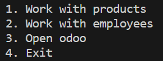
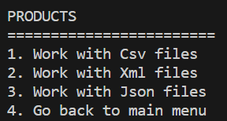
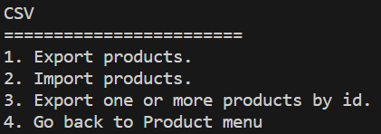
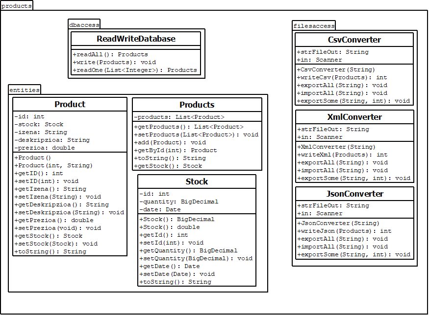
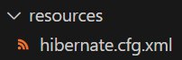

# DATA ACCESS
### This program is a Universal Conversor that can import and export data from PostgreSQL to Csv, Xml and Json files, and vice versa.

First of all, to keep going with the technical development documentation, this is the parts it is divided on:

1. [User guide](#id1)
2. [Technical development](#id2)  
   2.1. [Project Structure](#id2.1)  
   2.2 [Connection with database using Hibernate](#id2.2)  
   2.3 [Working with data](#id2.3)       
      - [Getting data](#id2.3.1)    
      - [Export data](#id2.3.2)
      - [Import data](#id2.3.3)

# 1. User guide <a name="id1"></a>
When first running the program, a `main menu` with two main different options will be displayed:

 

The first two options allows to work with both products and employees. If you select the third option, it will access to odoo, and the last option will exit the program.  

When selecting the first or the second options, the menu is going to open the next submenu:

  

As you can see, there are another three options that allows you to work with `CSV, XML or JSON` files, depending what you want to convert.  

When selecting any of those options, another submenu is going to be displayed with this options:



This new submenu (First option, CSV) is the one that is going to do the convert, and you can choose what type of conversion to do.

Selecting the first option, the program will export data from the database to a csv file (it can be xml or json, depending on the option you selected before). 

By selecting the second one, the program will import data from a file to the database. For this option to work properly, the file that is going to be imported has to follow the structure of the `Product` entity class.

The third option exports on or more products with the ids you are going to choose, and the last on will go back to selected menu.

All the time a conversion is done correctly, the next sentence will appear: `The conversion has been made`

And if there is any error with conversion the next message will appear: `Conversion could not be done
`

> [!WARNING]
> When exporting from database the files are going to be saved inside `konbertsore-unibertsala`, and the files that you want to import needs also to be located there so the program can work properly.

# 2. Technical development <a name="id2"></a>
## 2.1 Project structure <a name="id2.1"></a>
To visualize the project structure in a better way, this is the class diagram for the products, that is inside the model.



Inside the products, we can find three different directories:

- dbaccess: ReadWriteDatabase (read and write data from/into the database)
- filesaccess: CsvConverter, XmlConverter and JsonConverter (do the conversions between files and database)
- entities: Product, Stock (select where to take the data from) and Products (stores the products in a list and has some methods)

## 2.2 Connection with database using Hibernate <a name="id2.2"></a>
To start with the connection, it is mandatory to have the `hibernate.cfg.xml` file in the resources folder.



This xml file is where the database connection is configured. It also maps Java classes Product, Stock, Employee, and Department to their corresponding database tables.

```java
<property name="hibernate.connection.url">jdbc:postgresql:/192.168.65.120:5432/icer</property>
<property name="hibernate.connection.username">odoo</property>
<property name="hibernate.connection.password">Admin123</property>
<property name="hibernate.connection.driver_class">org.postgresql.Driver</property>
<property name="hibernate.transaction.jta.platform"/>

<mapping class="talde2.model.products.entities.Product"/>
<mapping class="talde2.model.products.entities.Stock"/>
<mapping class="talde2.model.employees.dbaccessemployees.Employee"/>
<mapping class="talde2.model.employees.dbaccessemployees.Department"/>
```

This project handle two different type of data to convert: `Products` and `Employees`.

## 2.3 Working with data <a name="id2.3"></a>

### 2.3.1 Getting data <a name="id2.3.1"></a>

To interact with the database, the application uses Hibernate's session management. The data is retrieved and manipulated through the use of various entity classes, including `Product` and `Stock`.

#### Product Class
The `Product` class represents products in the application. It has attributes such as `id`, `izena` (name), `deskripzioa` (description), `stock`, and `prezioa` (price). The class also contains methods to get and set these attributes, as well as a custom `toString` method for representing the product as a string.

```java
@Entity
@Table(name = "product_template")
public class Product {
    @Id // Defining the primary key.
    @Column(name = "id") // Select the column of the database.
    private int id;

    // Make a join with the table product_template. The relation is 1:1, therefore the conection is OneToOne.
    @OneToOne     
    // In order to make the connection correctly, we have to reference the column we want to join.
    // We need to specify the column in stock_quant and the column in the product_template where the join is made.
    @JoinColumn(name = "id", referencedColumnName = "id")     
    private Stock stock;

    // Column definition is used to especify the data type of the database.
    @Column(name = "name", columnDefinition = "jsonb")
    // Before inserting data into the database, it will be transformed to jsonb.
    @ColumnTransformer(write = "?::jsonb")
    private String izena;
    ...
}
```

#### Stock Class
The `Stock` class represents stock quantities. It has attributes such as `id`, `quantity`, and `date`. The class also contains methods to get and set these attributes, as well as a custom `toString` method for representing the stock quantity as a string.

```java
@Entity
@Table(name = "stock_quant")
public class Stock {
    @Id // Primary key
    @GeneratedValue(strategy = GenerationType.IDENTITY) // Autogenerated id
    @Column(name = "id")
    private int id;

    @Column(name = "quantity")
    private BigDecimal quantity;
    ...
}
```
#### Products Class
The `Products` class is used to manage a list of products. It has a list of `Product` objects and methods to add products to the list, get products by their ID, and represent the list as a string. The class also includes a `getStock` method that returns the stock associated with a product.

```java
@XmlRootElement(name = "Products") // Maps a class or an enum type to an XML element.
public class Products {
    List<Product> products = new ArrayList<>(); // Initialize the list

    public List<Product> getProducts() {
        return products;
    }

    @XmlElement(name = "Product") // Maps a property to a XML element derived from property name.
    public void setProducts(List<Product> products) {
        this.products = products;
    }
    ...
}
```

#### Read data from database
To read data from a database, this steps have to be followed:

1- Create a configuration object
```java 
Configuration configuration = new Configuration().configure();
```
2- Opening a session
```java 
Session session = sessionFactory.openSession()
```
3- Starting the session
```java 
session.beginTransaction();
```
4- Query creation
```java 
session.createQuery("from Product", Product.class)
```
5- Commit changes
```java 
session.getTransaction().commit();
```
Following this steps, we will be able to read all the data "`from Product`" for the colums defined on the `Product` class.

#### Write data into database
To write data into a database, the steps are very similar from reading data, but there are a few changes to be made on the 4th step.

4- Merge into database
```java 
for (Product product : products.getProducts()) {
      session.merge(product);
}
```

As you can see, instead of creating a query to select the products, we will select the products from a list and adding them to the database by merging.


### 2.3.2 Export data <a name="id2.3.2"></a>

The application provides functionality to export data to various file formats:

#### Export data to CSV

The `CsvConverter` class includes methods to write and export data to a CSV file. It handles data conversion and manipulation, ensuring the proper export of products' information.

#### Export data to XML

The `XmlConverter` class contains methods to write and export data to an XML file. It utilizes JAXB for marshaling and unmarshaling Java objects to XML and vice versa, allowing for efficient data conversion.

#### Export data to JSON

The `JsonConverter` class provides functionalities for writing and exporting data to a JSON file. It utilizes JSON libraries to convert data from Java objects to JSON format, ensuring the integrity of the exported data.

### 2.3.3 Import data <a name="id2.3.3"></a>

The application also allows for the import of data from various file formats back into the database:

#### Import data from CSV

The `CsvConverter` class includes methods to read data from a CSV file and import it back into the PostgreSQL database.

#### Import data from XML

The `XmlConverter` class contains methods to read data from an XML file and import it back into the PostgreSQL database.

#### Import data from JSON

The `JsonConverter` class provides functionalities for reading data from a JSON file and importing it back into the PostgreSQL database.  